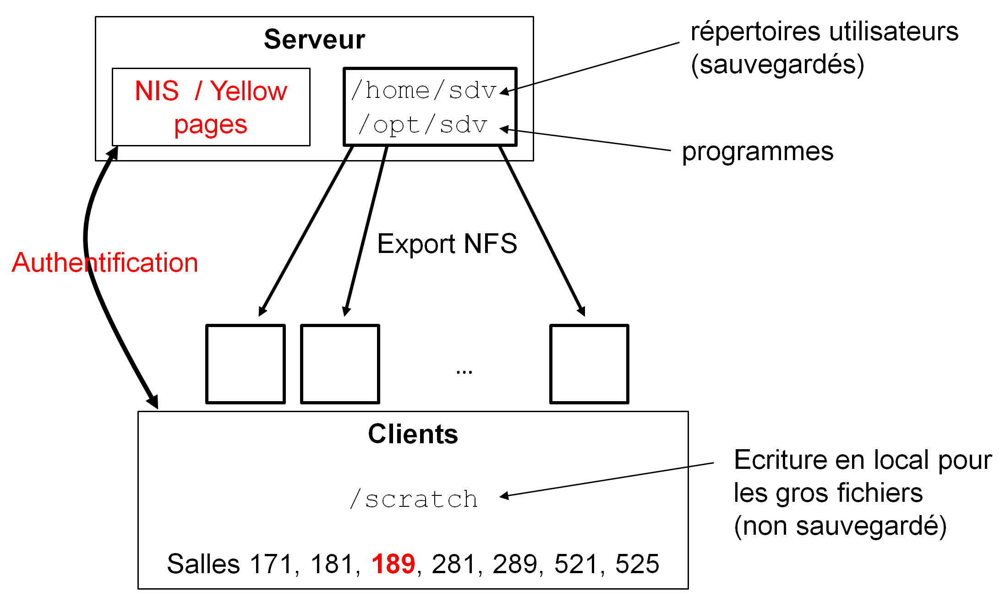

# Utilisation de la salle informatique Lamarck B 189 de l'Université Paris Diderot

## Accès

La salle Lamarck B 189 est située au premier étage du [bâtiment Lamarck B](https://campus.univ-paris-diderot.fr/file/7492/download?token=Og2VmjpP).

La clé qui ouvre cette salle se trouve dans un boîte à clés blanche située un étage au dessus (au 2e). Le code d'accès pour cette boite à clés vous sera communiqué.

Quand vous quittez la salle :

- Éteignez les machines (le soir uniquement)
- Fermez la salle à clé
- Remettez la clé dans la boîte à clés (y compris pour la pause déjeuner). Ne l'emportez surtout pas avec vous !


## Description de l'architecture

La salle 189 est équipée de 20 postes informatiques, d'un vidéo-projecteur et d'un écran de projection commandé électriquement.

Les postes informatiques sont équipés des systèmes d'exploitation Ubuntu 18.04 et Windows 7.

Le schéma de l'architecture est présenté dans la Figure @fig:architecture_sdv.

{ #fig:architecture_sdv }

L'authentification sous Ubuntu se fait via un serveur centralisé NIS (*Yellow pages*) avec le montage des répertoires des utilisateurs en NFS. Autrement dit, n'importe quel utilisateur peut s'authentifier et retrouver ses fichiers sur n'importe quelle machine d'enseignement (que ce soit dans la même salle ou dans une autre salle).

Le répertoire `/home` (contenant les données utilisateur) est situé sur le serveur est sauvegardé tous les jours. Ce répertoire étant exporté par NFS sur les clients des salles informatiques, il est essentiel de ne pas demander aux étudiants de copier un gros fichier (> 1Go) dans leur répertoire utilisateur en même temps. Si vous avez besoin d'utiliser de tels fichiers, il existe un répertoire `/scratch` en 777 qui est local à chaque machine. Ainsi une machine cliente, ne voit que son `/scratch` local. Si vous souhaitez copier un/des fichier(s) à l'avance sur chaque machine cliente de la 189, nous pouvons le faire pour vous ; dans ce cas, merci de nous en faire la demande 3 jours avant votre intervention. Enfin, ce répertoire `/scratch` n'est pas sauvegardé. 

Le mot de passe par défaut communiqué le premier jour doit impérativement être changé avec la commande `yppasswd` tapée dans un terminal. Après ce changement, il est vivement conseillé de se déconnecter et se reconnecter à la session Linux.

À l'issue de la formation, l'ensemble des comptes, ainsi que les données associées, seront détruits sans préavis.


## Environnements logiciels

Le *shell* par défaut pour tous les utilisateurs est *Bash*.

Les sessions Ubuntu disposent de la plupart des logiciels de base :

- commandes Unix classiques (`ls`, `pwd`, `grep`...)
- suite bureautique LibreOffice
- navigateur web Firefox
- FileZilla
- VLC
- xmgrace
- éditeurs de texte : vim, emacs, nano, gedit, geany
- Python 2.7 et 3.6
- R 3.4.4

Des logiciels de bioinformatique sont disponibles dans `/opt/sdv/` et directement accessibles dans le `$PATH`. Notamment :

- IGV 2.4.16 (à lancer avec la commande `/opt/sdv/bin/igv`)
- Cytoscape 3.6.1 (à lancer avec la commande `/opt/sdv/bin/cytoscape`)


## Conda

Conda 4.5.11 est également disponible. Nous recommandons l'utilisation d'environnements conda (fichiers `.yml`) dédiés pour l'installation et le déploiement d'écosystèmes logiciels spécifiques (Python, R, outils NGS).

- Les logiciels disponibles dans conda sont listées [ici](https://anaconda.org/anaconda/repo)
- La doc de conda pour [gérer les environnements](https://docs.conda.io/projects/continuumio-conda/en/latest/user-guide/tasks/manage-environments.html)

Après avoir demandé à l'équipe système de vous créer le répertoire adéquate, vous pourrez créer vos environnements conda dans `/home/sdv/conda_env/<nom-utilisateur>/`.

La commande pour créer l'environnement `toto` à partir du fichier `toto.yml` pour l'utilisateur `bob` est :
```
$ conda env create --prefix=/opt/sdv/conda_env/bob/toto -f toto.yml
```

Pour ensuite charger cet environnement depuis n'importe quelle machine :
```
$ conda activate /opt/sdv/conda_env/bob/toto
```

Le nom de l'environnement entre parenthèses devrait alors apparaître à gauche de la ligne d'invite de commande.

Pour quitter l'environnement :
```
$ conda deactivate
```
